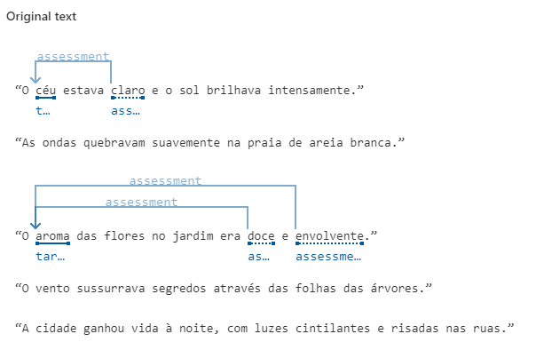
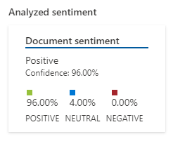
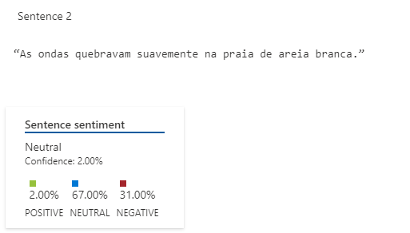
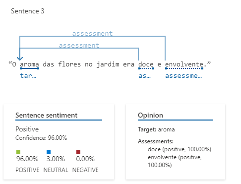

# Análise de texto usando o Language Studio
Nesse projeto da DIO, tive que usar o Language Studio para analisar os sentimentos e opiniões do que estava escrito.

## Testando
Para começar, usei as seguintes sentenças geradas por AI para que o Language Studio avaliasse:

Assim que iniciei, ele analisou o texto todo e me deu a seguinte informação:

Com as sentenças dadas ele realmente acertou, não tinha nada de negativo no texto, o sentimento era mais positivo mesmo!

Mas ele também analisou parte por parte, vejamos:

### Primeira sentança

Creio que eu a parte que estava "negativa" era por conta da palavra chave "quebravam", ele também não tinha tanta certeza dessa anaçise, tanto que podemos ver a porcentagem de "Confidence" que estava em 2.00%.

### Segunda sentença

Aqui podemos ver que a análise já estava mais precisa, tanto que a porcentagem dessa vez estava maior que na primeira sentença!

## Opinião
Adorei conhecer essa ferramenta e sem dúvidas é muito útil! Muitos sistemas podem aproveitar dessa tecnologia para poupar muito tempo na hora de analisar a opinião do publico em relação a algo.

Há muitas formas de aproveitar dessa tecnologia, como por exemplo, para moderar os chats de jogos e aplicar penalizações caso haja algum comportamento inadequado de algum jogador.